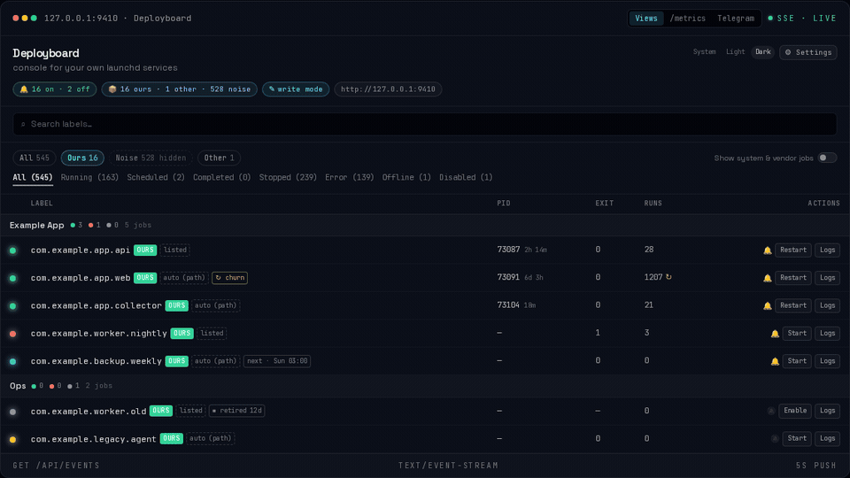
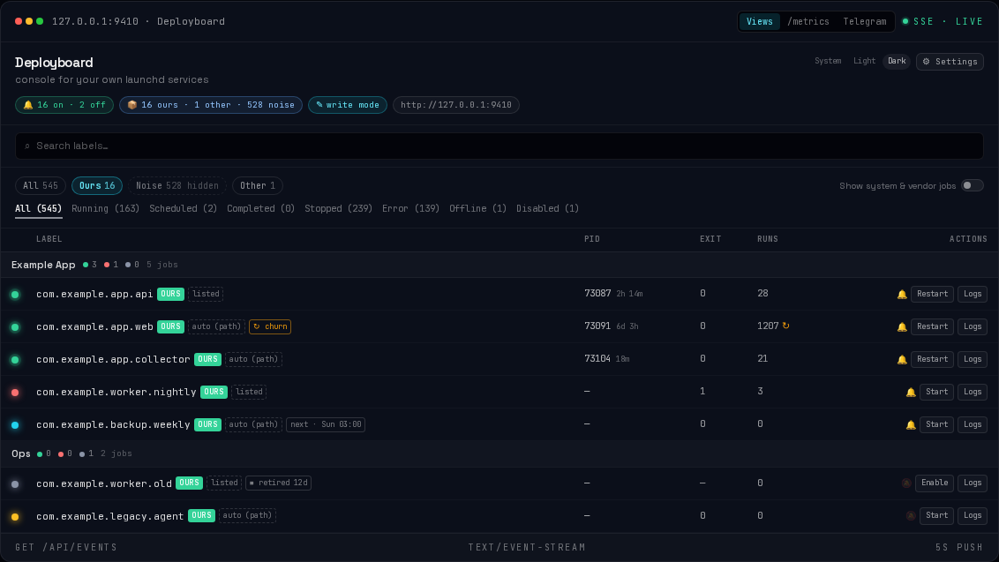
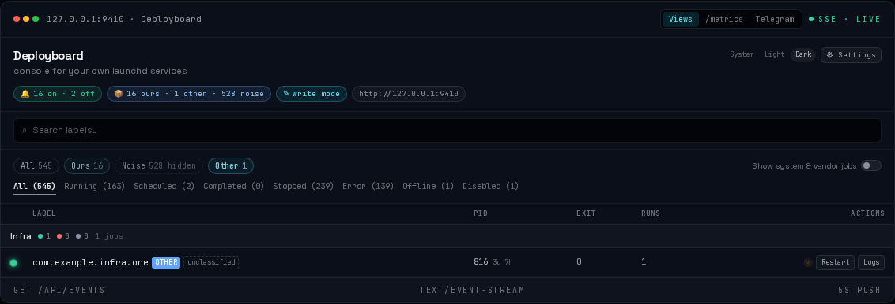
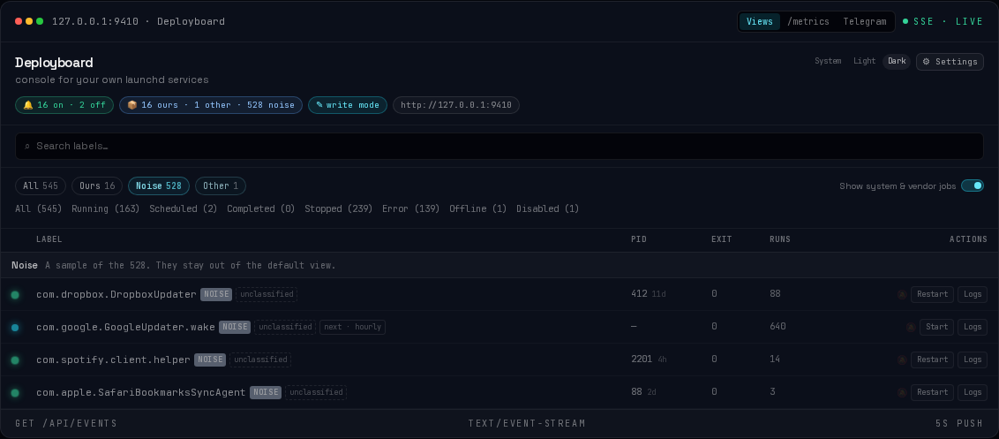
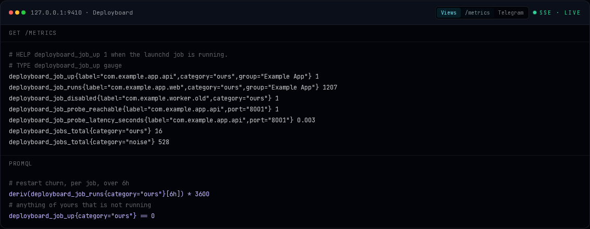
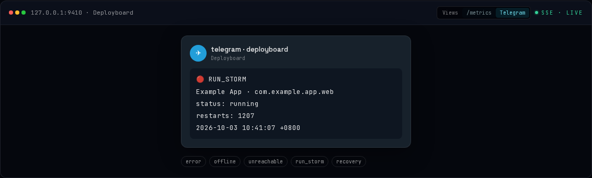

# Deployboard

[](https://github.com/francistse/deployboard/actions/workflows/ci.yml)
[](LICENSE)
[](https://github.com/francistse/deployboard/releases)
[](docs/INSTALL-macos.md)
[](https://francistse.github.io/deployboard/)

**Launchd has no dashboard. This is the console for managing your own launchd services in the browser, and it exports Prometheus metrics.**

**[Open the live briefing](https://francistse.github.io/deployboard/)** — the color version of this page. Click Ours, Other, Noise, then `/metrics` and Telegram.

launchd is hard to read from the terminal. One command installs the console. The browser shows status, logs, and alerts.

```bash
brew install --cask francistse/tap/deployboard
```



## Ours / Other / Noise

Your deployments are the default view. Other is unclassified. Noise is Dropbox, Chrome, Spotify, and the rest — one click away, never in the way.

**Ours**



**Other**



**Noise**



## The only launchd → Prometheus exporter

The same process serves `GET /metrics`. No sidecar.



## Telegram alerts

One message when a job breaks, one when it comes back. A switch per application.



Same console, live: [francistse.github.io/deployboard](https://francistse.github.io/deployboard/).

## Other ways to install

```bash
curl -fsSL https://raw.githubusercontent.com/francistse/deployboard/main/install-release.sh | bash
```

Or from a clone: `bash install.sh`. Flags, LaunchAgent, and uninstall: [`docs/INSTALL-macos.md`](docs/INSTALL-macos.md).

## Docs

| | |
|---|---|
| Install, config, uninstall | [`docs/INSTALL-macos.md`](docs/INSTALL-macos.md) |
| Prometheus series | [`docs/METRICS.md`](docs/METRICS.md) |
| Telegram alerts | [`docs/ALERTS.md`](docs/ALERTS.md) |
| Statuses, API, architecture | [`docs/REFERENCE.md`](docs/REFERENCE.md) |
| Development | [`docs/DEVELOPMENT.md`](docs/DEVELOPMENT.md) |
| Releases | [`docs/RELEASE.md`](docs/RELEASE.md) |
| Fork and rebase | [`docs/UPSTREAM.md`](docs/UPSTREAM.md) |
| Next steps | [`ROADMAP.md`](ROADMAP.md) |
| Product facts | [`PRODUCT-STATE.md`](PRODUCT-STATE.md) |

MIT. Fork of [launch-pilot](https://github.com/RoboZephyr/launch-pilot). Upstream behaviour stays; the fork only adds.
